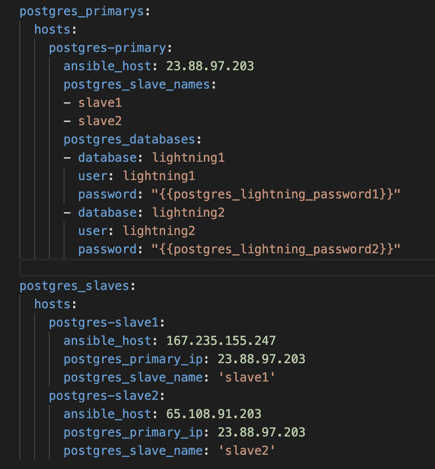
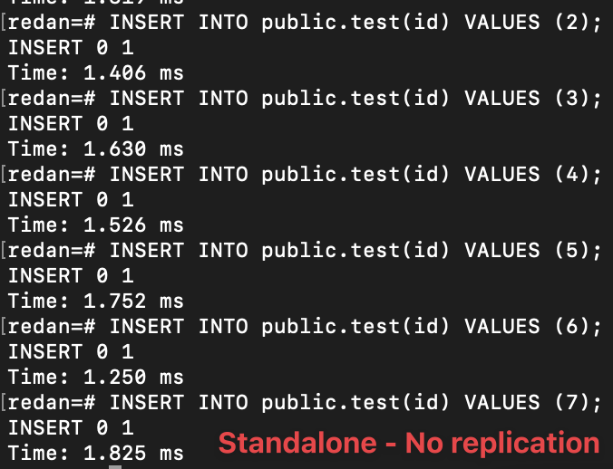
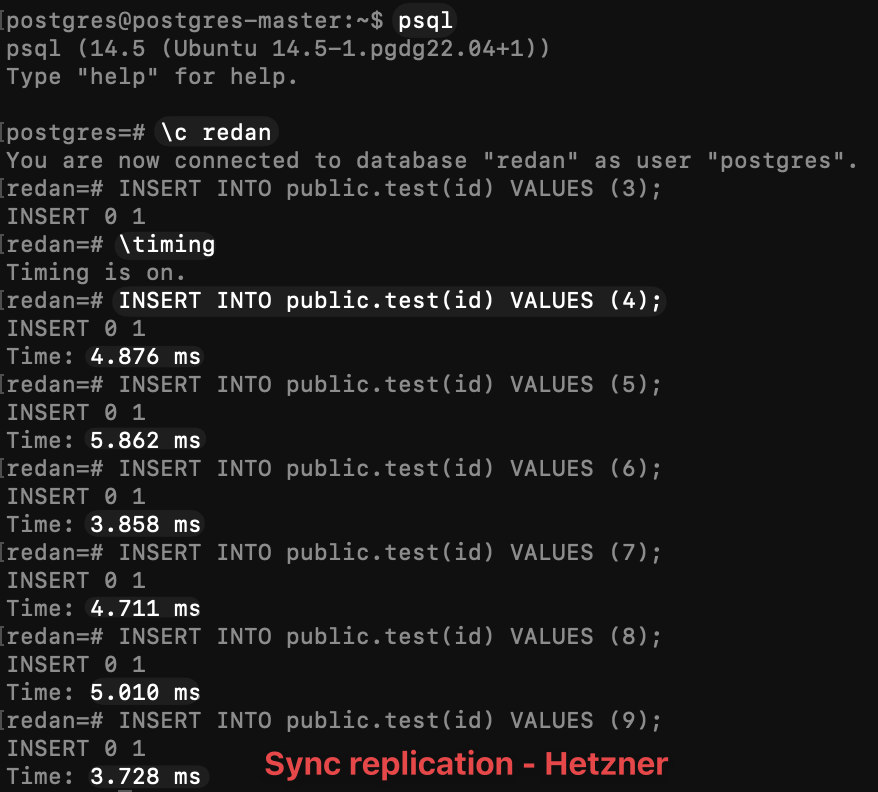
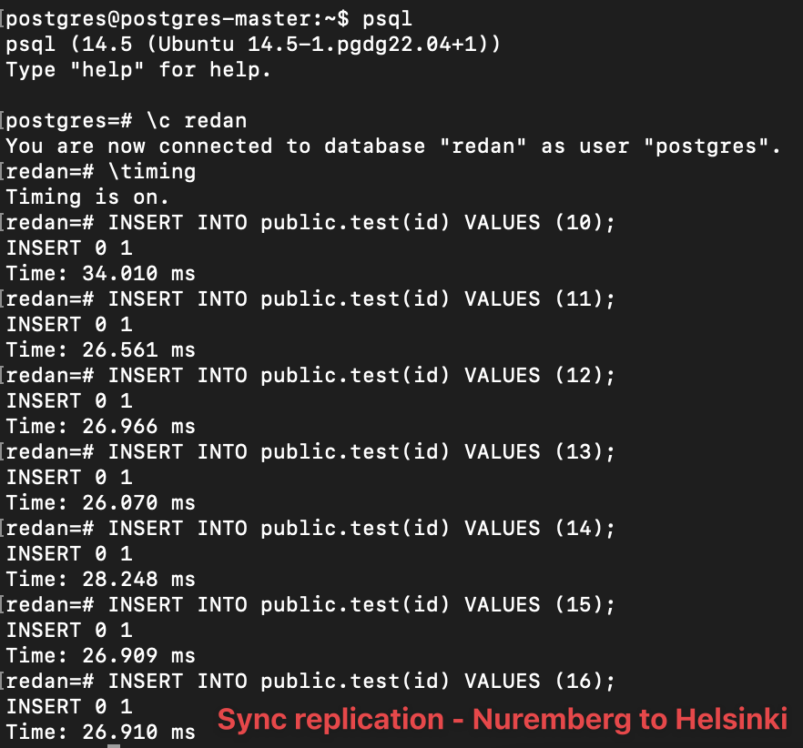

# Postgres Sync Cluster

This postgres ansible consists of 3 packages:
- [base](./base/README.md) Installs a base postgres and configures it for usage. It's a single node instance.
- [primary](./primary/README.md) Configures the server to act as a primary with standbys. The primary needs at least 1 standby to stay working.
- [slave](./slave/README.md) Configures the server as standby, replicates the data from the primary and syncs it.


## Setup

A standard setup consists of 
- The primary in the same datacenter as the lightning node.
- `slave1` in the same datacenter as the primary.
- `slave2` in a distant datacenter (in case the primary datacenter burns down or so).

The host file should look like this:


The postgres_slave_name can of course be more expressive than just in this example. The order of `postgres_slave_names` is important though. To improve latency, the first host should always be the one
closer to the primary.

`postgres_databases` should list all lightning databases. Important here: Use a different user/password combination with each node. Otherwise if one is hacked, all others are hacked as well.

### General variables

- `postgres_allow_subnet` Default: 0.0.0.0/0. Sets the network from where postgres accepts connections. Should be limited to the private network for a secure setup.
- `postgres_redan_password` The base role creates a redan user for operations. This is the password for it.
- `postgres_repli_password` To replicate the servers, the role `primary` creates the `repli` user. This is the password for it.

## Latency

We need to keep an eye on latency because lightning nodes get slow really quickly in case latency increases.
In this test, all servers consisted of a default Hetzner CX11 with 1VCPU, 2GB Ram, 20GB SSD. A simple insert with
one column measured is used for the latency measurement.

### 1. Standalone server

To establish a baseline, as simple server without any replication has been tested.

Latency: ~1.6ms



### 2. Sync - Same datacenter

This is the setup we actually want. Slave1 is close and Slave2 is far away. Due to the configuration, only Slave1 is being waited for a response.
- Primary in Hetzner Nuremberg.
- Slave1 in Hetzner Nuremberg (different VM as primary).
- Slave2 in Hetzner Helsinki.

Latency: ~4.5ms



### 3. Sync - Same datacenter slave down

This is the exact same setup as in (2.) except that Slave1 has been turned off. Slave2 in Helsinki
automatically takes over the role as the synced node. This is our failover scenario
with increased latency. This should be only temporary until we fixed the Slave1.

Latency: ~29ms



## Helpers

```bash
# Show logs
less +G /var/log/postgresql/postgresql-14-main.log

# Show what users can access + auth method
cat /etc/postgresql/14/main/pg_hba.conf

# Main postgres config
cat /etc/postgresql/14/main/postgresql.conf 
```

### Check if slaves are synced

Run on primary:

```
psql -x -c "SELECT * from pg_stat_replication;"
```


`sync_state=sync` indicates that this node is actually synced. `sync_state=potential` indicates that this is the
fallback node. 


### Check if a connection can be established from one node to the other

```bash
psql -U %username% --host=%host_ip% -t -c "SELECT version();"
```

### Replacing a slave

A slave can always be replaced without any issues as long as another slave is still running. Just keep latency in mind.

### Manual failover (aka. switchover)

These are the steps used to promote a standby to the primary and restore the standbys.

Before you do anything, make sure you make snapshots/backups of the data to not lose anything!

1. Stop the lightning node `systemctl stop lightning`.
2. Stop the current primary `systemctl stop postgresql` or kill the VM.
3. Run `pg_ctlcluster 14 main promote` on the slave.
3. Setup a new slave that replaces the current primary.
4. Change the ansible variables so the promoted slave is the new master and
the other two postgres point to the primary.
5. Run the `primary` playbook on the newly promoted slave.
6. Run the `slave` playbook on both new slaves.
7. Check if everything is working with `psql -x -c "SELECT * from pg_stat_replication;"`
8. Change the wallet in the lightning config to the new primary ip.
9. Start the lightning node.

The old primary needs to be killed and can't be reused (in theory it can but is easier this way).